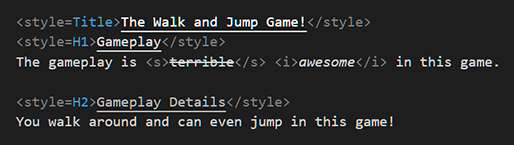

# Text Mesh Pro Rich Text Syntax Highlighter for Visual Studio Code

This Visual Studio Code Extension will highlight Text Mesh Pro [Rich Text](http://digitalnativestudios.com/textmeshpro/docs/rich-text/) syntax to make writing text files used in the Unity Game Engine more legible at a glance.

## Features

### Full Inline Preview

- Full support for previewing: `<b>`, `<i>`, `<s>`, `<u>`, `<noparse>`, and `<link>`.
	- Full support highlights open and closing tags and will apply theming to the content between tags such as emphasizing or underling text.

### Partial Preview

- Partial support for previewing all other rich text components. 
	- Partial support highlights open and closing tags but offers no special appearance to the content between the tags.
	- Partial support for: `<mark>`, `<align>`, `<color>`, `<cspace>`, `<indent>`, `<line-height>`, `<line-indent>`, `<lowercase>`, `<uppercase>`, `<smallcaps>`, `<margin>`, `<mspace>`, `<nobr>`, `<page>`, ` `, `<pos>`, `<size>`, `<voffset>`, `<width>`, and `<sprite>`.

### Custom Styles

- Special theming support for `<style>`.
	- Special theming allows for custom `editor.tokenColorCustomization` in your Visual Studio Code preferences to apply styling to each theme supported by your project.
	- The scope of special themes follows the format of `tmprt.styles.yourStyleNameGoesHere`.

## Limitations
- By design the extension ends continuous tags when a newline begins. This is because some files are read and displayed line by line without the expectation for closing tags to be used.
	- You may opt to use the ` ` tag to keep it all on one line if your text is not very long
	- This may become a preference in the future if it is possible.
- Starting a continuous Tag "A" then starting a continuous Tag "B" means that tag "A" can't be closed until tag "B" is closed.
	- Example: `<b>bold <i>bold and italic</b> italic</i>` will fail to close the bold tag because it was busy in the italics tag
	- This is occurs *only* in the code editor and TextMeshPro will render the text as expected.
- Currently restricted to `markdown`, `plaintext`, and `yarnspinner` languages.
- The style definitions for style syntax **are case-sensitive**. Therefore a style of `<style="Header">` will not match with `tmprt.styles.header` because it is expecting `tmprt.styles.Header`.
	- A best practice is to keep your `<style>` definitions consistent with the exact casing as defined in your `TMP_Style Sheet`